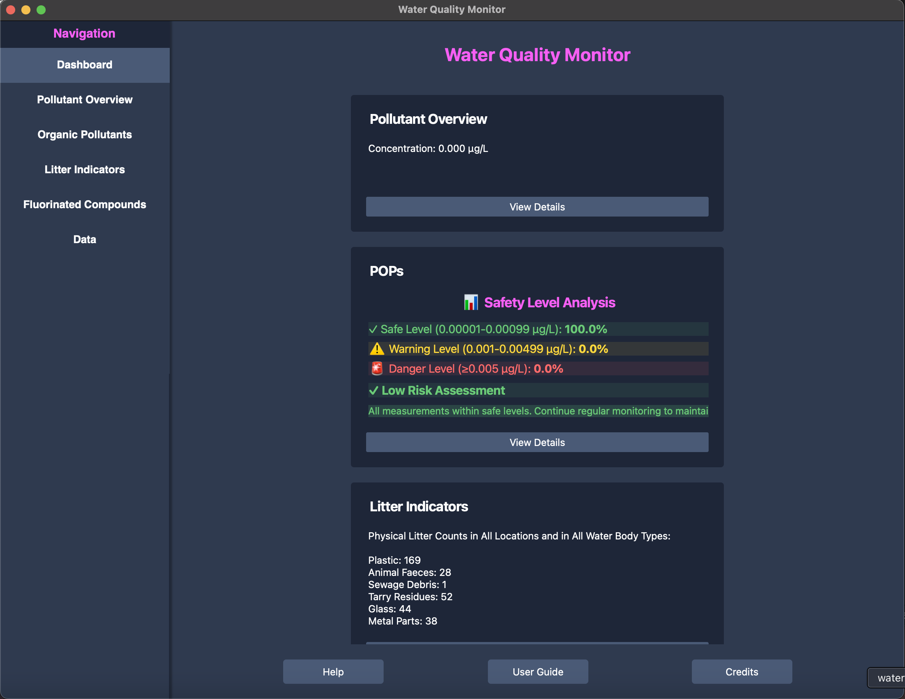
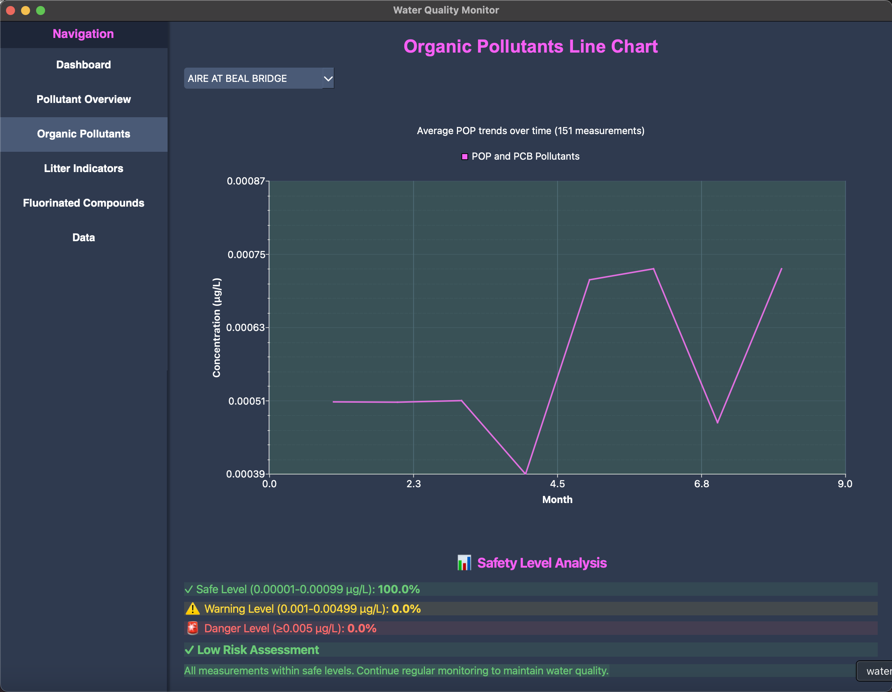

# Water Quality Qt Application

A Qt-based desktop application for visualizing UK/EU water quality data with emphasis on accessibility and internationalization.



## Features
- Interactive dashboard for water quality data visualization
- Detailed pollutant analysis pages
- Compliance monitoring and reporting
- Accessibility features
- Internationalization support

<p align="center">
  
  
  
</p>

## Back end Integration
We took full use of the starter code and made our model around it. The model is used to display the table and helps filter data for our pages. Moreover, we went with a universal approach where we made a `src/data/config.cpp` file where we have initialized the path to our CSV data, and it is used by all our pages. This ensures that if you were to test our application with a different dataset but the same format, you can just place the CSV in the `src/data` directory and change the path `"../src/data/Y-2024.csv"` to the `Config::UNIVERSAL_FILE_PATH`.

## Locale Usage
We have implemented 4 languages: English, Spanish, German, and French. Switching between them is simple. Go to `src/main.cpp` and edit the `"en_EN"` in this line:
```cpp
QLocale::setDefault(QLocale("en_EN"));
```
Then, change the file name `"water-quality-qt_en.qm"` to the file specified for each language.

We made the cmake file able to work in the Linux machine. For it to work on the latest Qt version change these two lines in your cmake:
```cpp
qt_standard_project_setup(I18N_TRANSLATED_LANGUAGES de fr es)
qt_add_translations(water-quality-qt)
```

## Prerequisites
- Qt 6.x
- CMake 3.16+
- C++17 compatible compiler

## Project Structure
- `src/`: Source files (where the coding takes place)
- `src/data/`: Our CSV data file is here

## Building the Project

1. Create build directory
   ```bash
   mkdir build
   cd build
   ```

2. Configure and build
   ```bash
   cmake ..
   make
   ./water-quality-qt
   ```

## Team Members
Muhammad Arif Noor(ID: 201692115),
Samantha Ramirez(ID: 201725731),
Josephine Bunce (ID: 201708435),
Shayan Hosseini,
